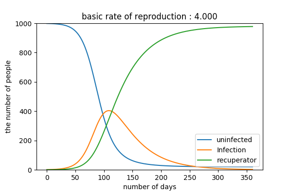
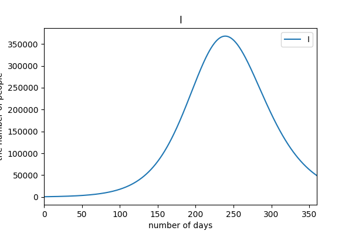
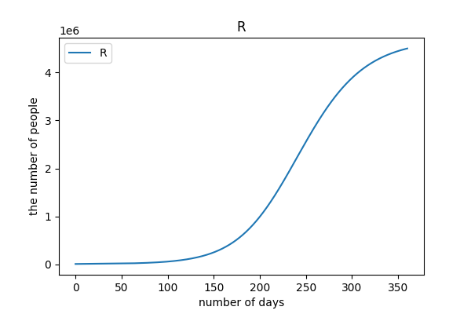
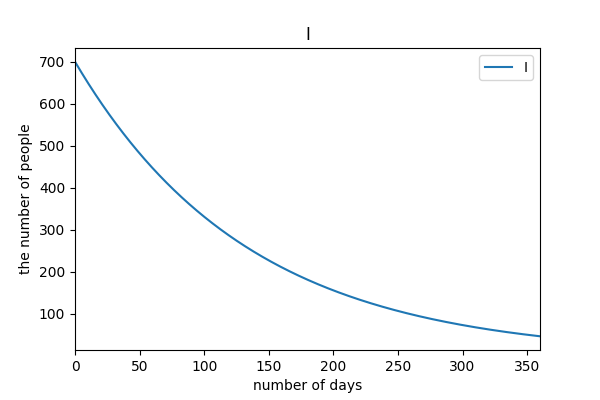
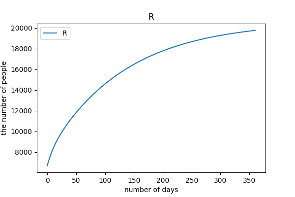
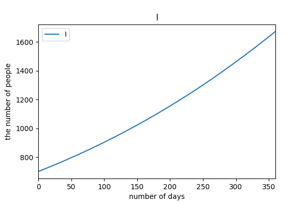
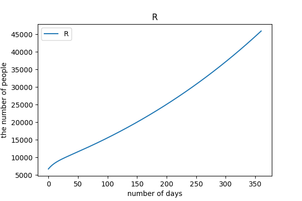
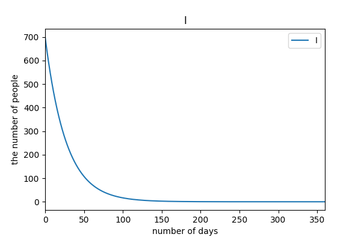
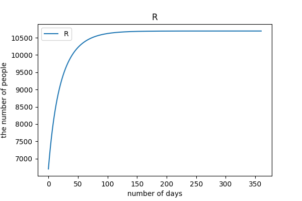
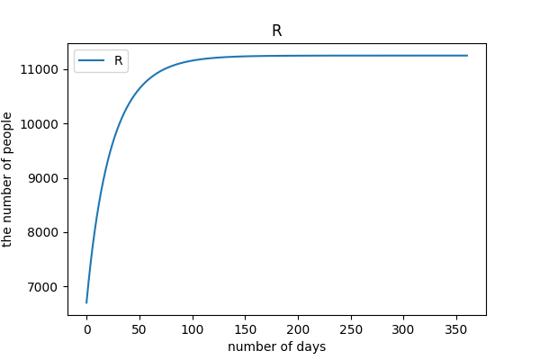

# 数理モデルによる感染症拡大シミュレーション
[Github](https://github.com/jabelic/SIQRmodel)

## 数理モデルとは
The wikipedia said 
>通常は、時間変化する現象の計測可能な主要な指標の動きを模倣する、微分方程式などの「数学の言葉で記述した系」のことを言う。モデルは「模型」と訳され「数理模型」と呼ばれることもある。元の現象を表現される複雑な現実とすれば、モデル（模型）はそれの特別な一面を簡略化した形で表現した「言語」（いまの場合は数学）で、より人間に理解しやすいものとして構築される。構築されたモデルが、元の現象を適切に記述しているか否かは、数学の外の問題で、原理的には論理的には真偽は判定不可能である。

簡単にいうと, 現象を複数の要素から構成されるものとして抽象化して, それの変化を数式で表したもの, ということ.

例えば人口成長を考えたい時には, 人口を$N$, 人口増加率を$r$として

$$
\begin{aligned}
\frac{dN(t)}{dt} &= r N(t)\\
N(0) &= N_0\\
\end{aligned}
$$

となる. 上記の系をMalthus modelという. もちろんこれだけでは条件が足りなくて, 例えば生存個体上限数を設けるなどをした方が良い(Logistic growth model).

## 感染症モデル

感染症の拡大モデルとして有名なのが次のSIRmodelである.

### SIRmodel
このモデルでは個体群を3つのグループに分ける. $S$を未感染者個体数, $I$を感染者個体数. $R$を快復および死亡個体数として記述する. 
全個体数を$N = S + I + R$で一定とし, 未感染者が感染者に接触した時の感染率を$\beta$, 快復および死亡率を$\gamma$とする.
すると, モデルは

$$
\begin{aligned}
\frac{dS(t)}{dt} &= -\beta S I\\
\frac{dI(t)}{dt} &= \beta S I  - \gamma I\\
\frac{dR(t)}{dt} &=\gamma I\\
\end{aligned}
$$

となる.

これをシミュレーションすると

このようになる. なお, 初期値, パラメータは

$N = 1000,\,S=999,\,I=1,R=0,\,\beta N = 0.5,\thinspace\gamma = \frac{1}{12}$

とした. このように感染力が高く, 感染から治癒までに12日間かかる場合は図のように病気が蔓延すると予測される.

それでは, COVID-19の感染シミュレーションには適用できるだろうか？

否, 少々条件を変える必要がある. まずSIRmodelは全人口を「未感染者」「感染者」「快復/死亡者」の３つのグループに分けた. この設定では全ての感染者は隔離されることなく病原体を未感染者に晒すリスクを持つことになっている.
COVID-19では隔離感染者というフェーズがあるためにこのモデルは適用できない. そこで提案されたのがSIQRmodelである.

### SIQRmodel

[小田垣](http://www001.upp.so-net.ne.jp/rise/images/%E6%96%B0%E5%9E%8B%E3%82%B3%E3%83%AD%E3%83%8A%E4%B8%80%E8%80%83%E5%AF%9F.pdf)
では以下のようなモデルが提案されている.

$$
\begin{aligned}
\frac{dS}{dt} &= -\beta S I \\
\frac{dI}{dt} &= (1 - q)\beta S I - p I - \gamma I\\
\frac{dQ}{dt} &= q\beta S I + pI - \gamma' Q\\
\frac{dR}{dt} &= \gamma I + \gamma ' Q\\
\end{aligned}
$$

SIQRmodelは全人口を「未感染者:$S$」「市中感染者:$I$」「隔離感染者:$Q$」「快復者/死亡者:$R$」の4つに分けて考える.
なお, $\beta$は未感染者が感染者に接触した時の感染率, 未感染者は$(1-q)\beta SI$が市中感染者となり, 残りの$q\beta SI$は隔離感染者となるとしている.
$\gamma$は市中感染者の治癒率であり感染から治癒の期間の逆数とし, $\gamma '$は隔離感染者の治癒率であり発症から治癒の期間の逆数としている.

graph LR;
S[S:未感染者] -- "(1-q)βSI" -->I[I:市中感染者]
I[I:市中感染者] -- pI --> Q[Q:隔離感染者]
Q[Q:隔離感染者] -- γ'Q --> R[R:快復者/死亡者]
S[S:未感染者] -- qβSI --> Q[Q:隔離感染者]
I[I:市中感染者] -- γI --> R[R:快復者/死亡者]

しかしこれでは未感染者から隔離感染者にフローが存在していて, これは矛盾が生じることになる.
COVID-19は未発症でも感染者は感染力を保持, 未発症のまま治癒することもあるため, 任意の感染者は一旦は市中感染者となる.
すなわち以下のようなモデルが望ましいと考えられる.

graph LR;
S[S:未感染者] -- βSI -->I[I:市中感染者]
I[I:市中感染者] -- pI --> Q[Q:隔離感染者]
Q[Q:隔離感染者] -- γ'Q --> R[R:快復者/死亡者]
I[I:市中感染者] -- γI --> R[R:快復者/死亡者]

$$
\begin{aligned}
\frac{dS}{dt} &= -\beta S I \\
\frac{dI}{dt} &= \beta S I - p I - \gamma I\\
\frac{dQ}{dt} &= pI - \gamma' Q\\
\frac{dR}{dt} &= \gamma I + \gamma ' Q\\
\end{aligned}
$$

ここでは[小田垣教授の論文の読み方](https://kichiro-talk.hatenablog.com/entry/2020/05/27/182644)
<!-- より感染力を持つのは感染から発症までおよそ5日, 発症後のおよそ7日としている. -->
すなわちγ=1/12, γ'=1/10とした. 発症が確認されれば感染力が咳などの症状の影響で感染リスクが拡大すると仮定して発症後の感染力を持つ期間を10日と独自に仮定した.

## Simulation
常微分方程式の数値計算には`scipy.odeint`を使用した.
数値解法はadams法(どのそれかは不明)である.

初期値は7.16.2020現在の[東京都新型コロナウイルス感染症対策サイト](https://stopcovid19.metro.tokyo.lg.jp/)の値を参考に概算で出したものを使用した.

|S|Q|I|R|
| --- | --- | --- | --- |
|9990900(人)|700(人)|1500(人)|6700(人)|

期間は360日であり, 
接触率は[小田垣](http://www001.upp.so-net.ne.jp/rise/images/%E6%96%B0%E5%9E%8B%E3%82%B3%E3%83%AD%E3%83%8A%E4%B8%80%E8%80%83%E5%AF%9F.pdf)
を参考にし, これからし得る政策とその基準を5ケースに分けた.
感染者の数が人口に対して非常に少ないため, ここでは感染者と快復者のグラフを示す.

#### case1
陽性者隔離率1％, 接触率12.6% (3月基準)

これからPCR検査率を下げ、接触率を下げる努力もしなかった場合

#### case2
陽性者隔離率5％, 接触率12.6% (3月基準)

PCR検査率を上げる努力をし, 接触率を下げる努力をしなかった場合.

#### case3
陽性者隔離率1％, 接触率9.6% (5月基準)

PCR検査率をあげる努力をせず, 外出自粛により接触率を下げた場合.

#### case4
陽性者隔離率5％, 接触率9.6% (5月基準)

PCR検査率をあげる努力をし, 外出自粛により接触率を下げた場合.

#### case5
陽性者隔離率8％, 接触率12.6% (3月基準)

PCR検査率をあげる努力をし, 外出自粛をせずにcase4の値を目指した場合.

## Analysis

case1は基本的にわずかな陽性者を隔離するにとどまる政策を想定しているので, 当然感染は拡大し, 一時東京都の感染者数は35万人になることが予想される.
残りのケースに関してはcase3とcase2, case4, case5の2つに分けられる.

case3は外出自粛により接触率を下げた場合であり, 陽性者を検査によりたくさん見つけ, 隔離する政策を取らない場合である.
case2~case5のうち, __case3は唯一グラフの概形が異なっていて, 感染者数が増え続けていて, 収束に向かう形を全くしていない.__
1年経ってもまだまだ感染者は増え続けるということである.

すなわち, 今外出自粛のみを緊急事態宣言などでひたすら頑張ったところで効果はないということ.

よって感染収束に対して __最も効率的な政策は隔離政策__ である. PCR検査を行い陽性者の発見を急ぐべきである.
外出自粛による接触率低下は優先されるものではない.

また, 実際の感染はクラスター感染などと呼ばれるように感染経路にはある程度偏りがあるとされている.
ある人口密集グループ内に1人の感染者がいて感染を広げる確率はそのグループ内の人口とその密度に依存する.
すなわちフェスや大規模ライブのようなものは感染確率が上がるということであるので, 避けられるのであれば避けたほうが良い.
しかし経済との兼ね合いなどもあるため, 小中規模のオフィスや飲食店は営業を再開すべきであろう.
都市封鎖などの政策は感染初期には有効だが, ある程度感染が広がった段階ではあまり意味がないことはcase3から予想される.

## References
- 小田垣 : [新型コロナウイルスの蔓延に関する一考察](http://www001.upp.so-net.ne.jp/rise/images/%E6%96%B0%E5%9E%8B%E3%82%B3%E3%83%AD%E3%83%8A%E4%B8%80%E8%80%83%E5%AF%9F.pdf)
- [小田垣教授の論文の読み方](https://kichiro-talk.hatenablog.com/entry/2020/05/27/182644)
- [東京都新型コロナウイルス感染症対策サイト](https://stopcovid19.metro.tokyo.lg.jp/)
- [SIQR モデルの表示 - Qiita](https://qiita.com/ekzemplaro/items/d4b079da3f172f6535b9)

<a href="https://twitter.com/share?ref_src=twsrc%5Etfw" class="twitter-share-button" data-show-count="false" data-size='large'>Tweet</a>

