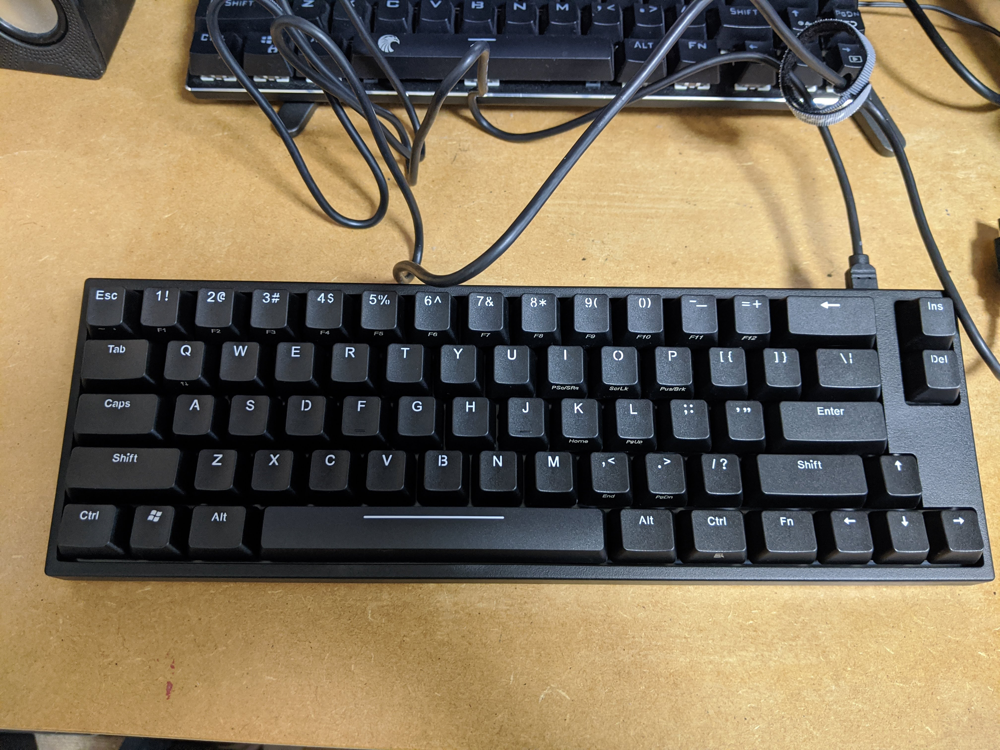
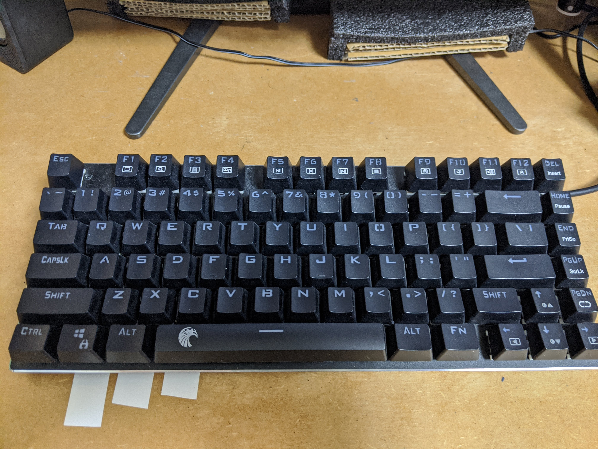
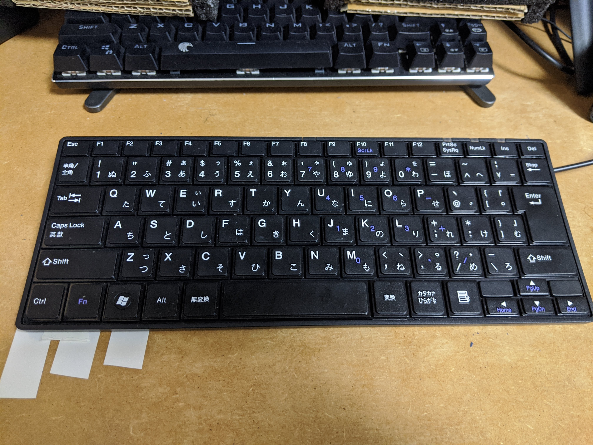

# キーボードを新しく買った

今回買ったキーボードは Ubuntu と Windows10 で使うためのもので, キー配列は US の 66 キー.

## 製品について

以下、スペック
| | |
| --- | --- |
|商品名|ARCHISS ProgresTouch RETRO TINY（タイニー）コンパクトメカニカルキーボード 英語 US ANSI 配列 66 キー 黒モデル|
|キーピッチ|19mm|
|キーストローク|4mm(黒軸、茶軸、青軸、赤軸)|
|ケーブル長 | 1.8 ｍ（脱着式）|
|サイズ | W325 x D110 x H28〜35mm（スタンド含まず）|
|重量 | 720g（ケーブル除く）|

### 所感

- スイッチ感はない
- 重いので持ち運びはしたくない
- 省スペース
- 低めのパームレストはあったほうがいい
- End, Home, `, などのキーは fn キーと合わせて叩くので慣れが必要

## 使用用途/以前使っていたもの/購入動機

使用 OS は Ubuntu18.04, Windows10. まだ Windows10 では試していない. 以前は Windows10 では e 元素の青軸のテンキーレスメカニカルキーボードを使っていた. 安くてよかったが, キー配列が少々特殊で, Ubuntu18.04 では使えなかった（設定が面倒）.
なので, Ubuntu18.04 では日本語配列の安心の SANWA 製のキーボードを使っていた（2000 円）.確かパンタグラフキーボードだったが, とても良かった. ただ日本語配列なのでタイプミスがおおくてしゃーない.
ubuntu でもメカニカルキーボードを使いたかったので購入に踏み切った.

[E 元素メカニカルゲーミングキーボード](https://www.amazon.co.jp/E%E5%85%83%E7%B4%A0%E3%83%A1%E3%82%AB%E3%83%8B%E3%82%AB%E3%83%AB%E5%BC%8F%E3%82%B2%E3%83%BC%E3%83%9F%E3%83%B3%E3%82%B0%E3%82%AD%E3%83%BC%E3%83%9C%E3%83%BC%E3%83%89-%E3%83%AC%E3%82%A4%E3%83%B3%E3%83%9C%E3%83%BCLED%E3%83%90%E3%83%83%E3%82%AF%E3%83%A9%E3%82%A4%E3%83%88%E4%BB%98%E3%81%8D-USB%E6%9C%89%E7%B7%9A81%E3%82%AD%E3%83%BC%E3%82%A2%E3%83%B3%E3%83%81%E3%82%B4%E3%83%BC%E3%82%B9%E3%83%88%E3%82%AD%E3%83%BC-%E3%82%B2%E3%83%BC%E3%83%A0%E7%94%A8%E3%82%AD%E3%83%BC%E3%83%9C%E3%83%BC%E3%83%89-%E8%B5%A4%E8%BB%B8%E3%83%BC%E3%83%96%E3%83%A9%E3%83%83%E3%82%AF/dp/B072K7N82F/ref=pd_lpo_147_t_0/356-7472784-1144458?_encoding=UTF8&pd_rd_i=B08DCT93Z8&pd_rd_r=ce297707-5148-415b-b417-80845d9b16da&pd_rd_w=bJR6M&pd_rd_wg=Xak05&pf_rd_p=4b55d259-ebf0-4306-905a-7762d1b93740&pf_rd_r=HF80RNBQTV793VY8501M&refRID=HF80RNBQTV793VY8501M&th=1)

[サンワサプライ USB スリムキーボード パンタグラフ テンキー無し ブラック](https://www.amazon.co.jp/%E3%82%B5%E3%83%B3%E3%83%AF%E3%82%B5%E3%83%97%E3%83%A9%E3%82%A4-USB%E3%82%B9%E3%83%AA%E3%83%A0%E3%82%AD%E3%83%BC%E3%83%9C%E3%83%BC%E3%83%89-%E3%83%86%E3%83%B3%E3%82%AD%E3%83%BC%E3%81%AA%E3%81%97-%E3%83%96%E3%83%A9%E3%83%83%E3%82%AF-SKB-SL18BKN/dp/B01K3EGFXI/ref=sr_1_12?__mk_ja_JP=%E3%82%AB%E3%82%BF%E3%82%AB%E3%83%8A&dchild=1&keywords=SANWA+%E3%82%AD%E3%83%BC%E3%83%9C%E3%83%BC%E3%83%89&qid=1598281301&s=computers&sr=1-12)

上のようなことがあって, 現在に至るというわけである.

## Ubuntu18.04 における日本語入力切り替え設定

Alt キーで切り替え出来ると嬉しかった. 結果から言うと, スイッチはできるようになったが切り替え機能なので Mac のように「かな」「英字」のような割当はしていない. できるとおもうけど面倒でやってない.

だいたい下の通りにやったらうまくいった. (本来はここで詳しく書くべきだけど, なんせキーボードの設定をしていたものでメモを残す気にはならなかったのでメモがない. 書くまでもなかったのかな.)

[［Ubuntu］US キーボード配列で日本語入力できるようにする](https://medium.com/kaleidot725/ubuntu-us%E3%82%AD%E3%83%BC%E3%83%9C%E3%83%BC%E3%83%89%E9%85%8D%E5%88%97%E3%81%A7%E6%97%A5%E6%9C%AC%E8%AA%9E%E5%85%A5%E5%8A%9B%E3%81%A7%E3%81%8D%E3%82%8B%E3%82%88%E3%81%86%E3%81%AB%E3%81%99%E3%82%8B-c2c41dc3599a)

ちなみに, Amazon で買うと 10k するらしいがヨドバシオンラインショップで 6.3k で買えた.
