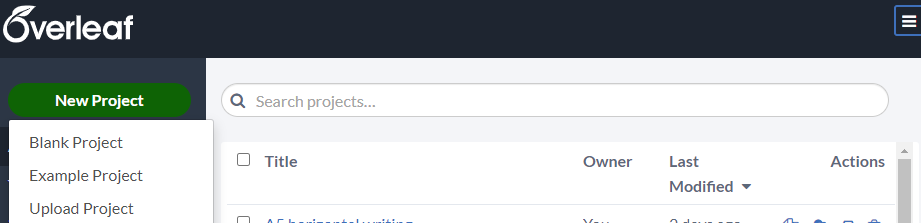
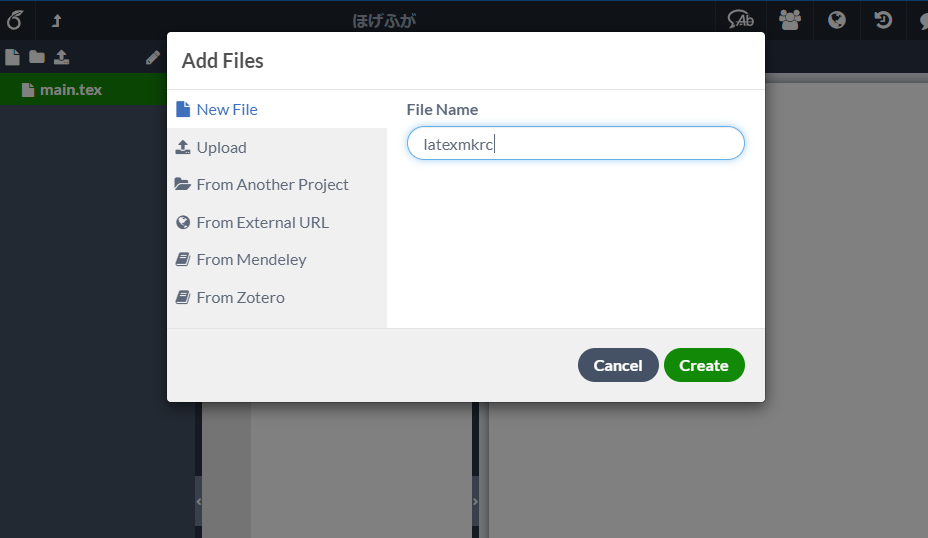
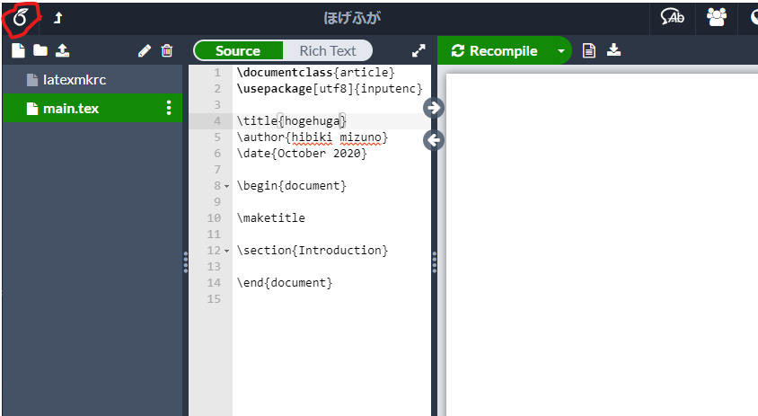
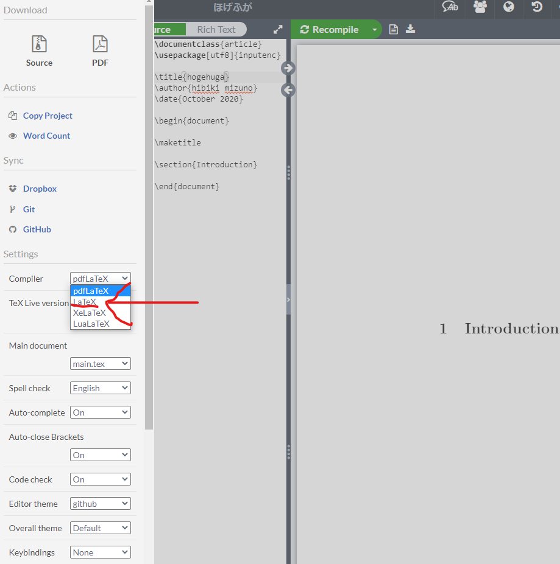
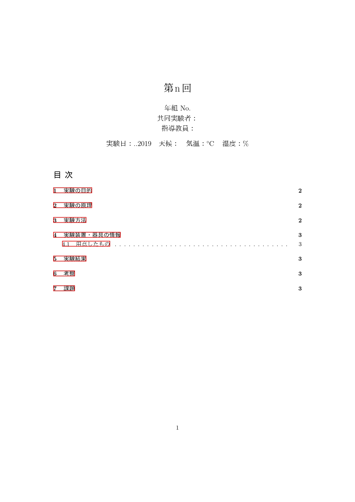
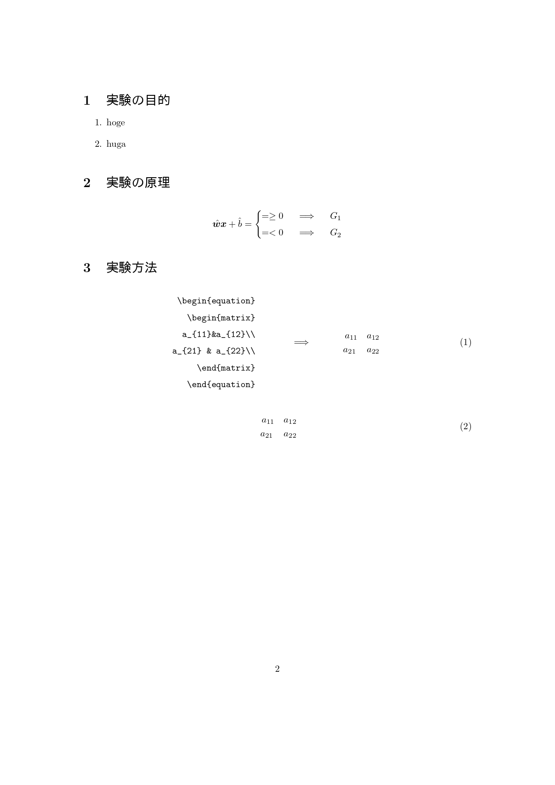
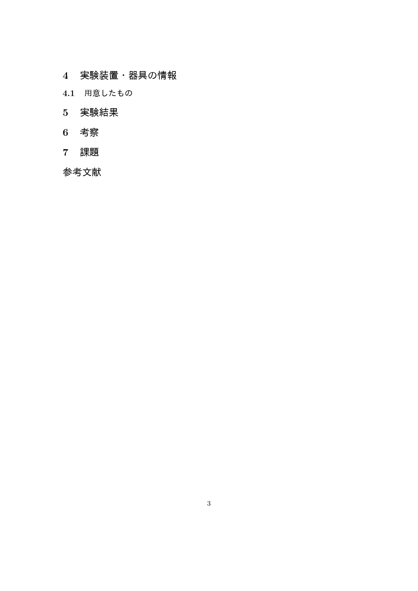

# 実験レポートのための LaTeX（テンプレあり）

実験レポートのための LaTeX のスクリプトをおいておきます。

[LaTeX tips for student(me) - Qiita](https://qiita.com/jabelic/items/bf0b86882a4f3525661d)とか[TeX/LaTeX 入門講座](https://qiita.com/jabelic/items/7c8c10d241449d834878)の内容もちょっとだけ載せておきます。

## Overleaf のススメ

LaTeX の環境を整えるのはとても大変です。こんな感じで([LaTeX 環境構築 - scrapbox.io/jabelic-public](https://scrapbox.io/jabelic-public/LaTeX_%E7%92%B0%E5%A2%83%E6%A7%8B%E7%AF%89))手間がかかるし時間もかかるので、サクッとレポートないしは文書を作成したい場合はオンラインエディタを使うのが懸命だと思います。
オンラインエディタとして一番有名なのが[Overleaf](http://overleaf.com/)です。

### Overleaf の日本語設定

<br>
<details><summary>blankProjectを作成(クリックで開く)</summary>

</details>
<br>
<details><summary>latexmkrcというファイルに以下をコピペ（拡張子なし）(クリックで開く)</summary>

</details>

```tex
$latex = 'platex';
$bibtex = 'pbibtex';
$dvipdf = 'dvipdfmx %O -o %D %S';
$makeindex = 'mendex %O -o %D %S';
$pdf_mode = 3;
```

<br>

<details><summary>Menuを開く(クリックで開く)</summary>

</details>
<br>
<details><summary>"latex"を選ぶ(クリックで開く)</summary>

</details>

## LaTeX の基本的な使い方

[TeX/LaTeX 入門講座](https://qiita.com/jabelic/items/7c8c10d241449d834878)参照。気が向けばここにも書く。

## 実験レポート用のソースコード

コピペして使ってね。

<details><summary>ソースコード(クリックで開く)</summary>

```tex
\documentclass{jarticle}
\usepackage{geometry}
%\usepackage[dvipdfmx]{graphicx}
\usepackage{amssymb}%白抜き文字(mathbb)
\usepackage[dvipdfmx]{hyperref,graphicx}
\usepackage{pxrubrica}
\usepackage{bm}
\usepackage{amsmath}
\usepackage{ascmac}
\usepackage{comment}
\usepackage{url}
\usepackage{siunitx}
\usepackage{listings}
\usepackage{here}%[H]で強制的にその位置に図や表を出力
\lstset{%
  language={Python},
  basicstyle={\small},%
  identifierstyle={\small},%
  commentstyle={\small\itshape\color[rgb]{0,0.5,0}},%
  keywordstyle={\small\bfseries\color[rgb]{0,0,1}},%
  ndkeywordstyle={\small},%
  stringstyle={\small\ttfamily\color[rgb]{1,0,1}},
  frame={tb},
  breaklines=true,
  columns=[l]{fullflexible},%
  numbers=left,%
  xrightmargin=0zw,%
  xleftmargin=3zw,%
  numberstyle={\scriptsize},%
  stepnumber=1,
  numbersep=1zw,%
  lineskip=-0.5ex%
}

%\begin{eqnarray*}\end{eqnarray*}
\title{ 第n回 }
\author{ 年組 No. \\共同実験者： \\指導教員：}
\date{実験日：..2019\ \ \ 天候：　気温：\si{\degreeCelsius}　湿度：\%}
\begin{document}

\maketitle
\tableofcontents%目次を表示

\newpage
\section{実験の目的}
\begin{enumerate}
\item hoge
\item huga
\end{enumerate}

\section{実験の原理}
\begin{equation*}
\hat{\bm{w}}\bm{x} + \hat{b} =
     \left\{
     \begin{aligned}
          = \geq 0 \hspace{5mm}\Longrightarrow\hspace{5mm}G_1\\
          = < 0 \hspace{5mm}\Longrightarrow\hspace{5mm}G_2\\
     \end{aligned}
     \right.
 \end{equation*}

\section{実験方法}
\begin{equation}\
     \begin{aligned}\
\verb|\begin{equation}|\\
\verb|\begin{matrix}|\\
\verb|a_{11}&a_{12}\\|\\
\verb|a_{21} & a_{22}\\|\\
\verb|\end{matrix}|\\
\verb|\end{equation}|\\
     \end{aligned}\
     \quad \text{$\hspace{10mm}\Longrightarrow\hspace{10mm}$}\
     \begin{aligned}\
\begin{matrix}\
a_{11}&a_{12}\\
a_{21} & a_{22}\\
\end{matrix}\
     \end{aligned}\
 \end{equation}\

\begin{equation}\
%\begin{aligned}\
\begin{matrix}\
a_{11}&a_{12}\\
a_{21} & a_{22}\\
\end{matrix}\
%\end{aligned}\
 \end{equation}\


\section{実験装置・器具の情報}
\subsection{用意したもの}

\section{実験結果}

\section{考察}

\section{課題}

\begin{thebibliography}{9}
  %\bibitem{1} 並木雅俊 「大学生のための物理入門」P.95, 98 (2010).
  %\bibitem{1}\href{http://www.wakariyasui.sakura.ne.jp/p/wave/onnpa/onnpa.html}{音波　■わかりやすい高校物理の部屋■}\url{http://www.wakariyasui.sakura.ne.jp/p/wave/onnpa/onnpa.html}

\end{thebibliography}

\vspace{10.0cm}

\end{document}

```

</details>

<details><summary> 出力(クリックで開く) </summary>



</details>

## 実験レポートでよく使うなにか

[LaTeX tips for student(me) - Qiita](https://qiita.com/jabelic/items/bf0b86882a4f3525661d)を参照。後で書くかも。

<a href="https://twitter.com/share?ref_src=twsrc%5Etfw" class="twitter-share-button" data-show-count="false">Tweet</a><script async src="https://platform.twitter.com/widgets.js" charset="utf-8"></script>
