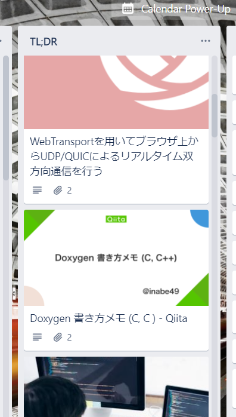

# tl;dr の管理ツール

## はじめに

tl;dr とは、"Too Long, Didin't Read"の略で、「長すぎるので読まない」という意味から転じて、「後で読む」もしくは「要約」みたいな使い方をするインターネットスラングです。

たとえば、ドキュメントを slack などでシェアするときに添える要約の先頭に tl;dr と書いたり、ちょっと長くて今すぐには読めない技術記事などを"tl;dr"と呼んだりします。

（あくまでインターネットスラングなので、基本的にはフォーマルな場では使わないほうが良いみたい。）

そんな tl;dr な技術記事は Twitter の TL から流れてきたものや開発中にググって出てきたもの、はたまた他人の技術ブログの参考先など、多分に、タイミングを問わず現れます。

そんな後で読みたい技術記事などは、とりあえず Tab を残して、放置することが常習的でした。

それが重なり気づいたら Favicon だらけでどの記事がどのあたりにあるかがわかりにくくなり、更には消し忘れの Tab なのか後で読もうと思って残しておいた Tab なのかおぼろげで、まあいいやと消してしまう。そしてこれがすごくもったいないことだと感じるようになりました。

**今回はこの、「後で読む」tl;dr な技術記事やジャーナルを管理する解決策として、Chrome の拡張機能を作りました。** 保存される記事情報は Slack と Trello に送信され、タスクとして蓄積されます。

### TL;DR(要約)

TL;DR 情報を slack と Trello に保存する Chrome Extension を作った。<br>
使用した技術は

- [TrelloAPI](https://developer.atlassian.com/cloud/trello/rest/api-group-actions/)
- [Slack Incoming Webhook](https://slack.com/intl/ja-jp/help/articles/115005265063-Slack-%E3%81%A7%E3%81%AE-Incoming-Webhook-%E3%81%AE%E5%88%A9%E7%94%A8)
- [Chrome Extension API](https://developer.chrome.com/docs/extensions/reference/)

の３つ。

## 下準備

### TrelloAPI

#### API key, Token を取得

- 【APIkey】[https://trello.com/1/appKey/generate](https://trello.com/1/appKey/generate) にアクセスして<span style="color:#5555ff;">Key</span>を取得

  同じく、

  > Token:
  > Most developers will need to ask each user to authorize your application. If you are looking to build an application for yourself, or are doing local testing, you can manually generate a [Token].

  とあるので

- 【APIToken】'Token'をクリック。許可(Allow)を押すと<span style="color:#5555ff;">APIToken</span>が表示されるので控えておく。

::: tip
key, token はダブルクリックして、コピーしたほうが良さそう。カーソル当ててビーッと引っ張って選択するやり方だとしくる可能性がある(らしい)。
:::

#### Trello の username, Board, List の情報を取得する。

<span style="font-size: 80%; color: gray;">Script を書いてプログラムから取得する方法が一般的みたいだけど、各種 id をとってくるだけなので Chrome から普通にアクセスしたほうがノントラブルでできそう（私はそうしました）。</span>

- あらかじめ tl;dr の情報を投稿したい Board と List を作っておく。

- 先程取得した<span style="color:#5555ff;">APIkey</span>と<span style="color:#5555ff;">APIToken</span>を以下の URL に当てはめてアクセス。
  `https://api.trello.com/1/members/me/?key=<APIKey>&token=<APIToken>`

  JSON 形式のデータが表示されます。

  - <span style="color:#5555ff;">username</span>を取得<br>
    `"url":"https://trello.com/xxxxxx"`
    `xxxxxx`が username
    もしくは Trello 右上、Profile and Visibility, Activity, Cards, Settings のどれかをクリック
    上部、@マークの後ろに続く文字列が username

  - <span style="color:#5555ff;">Board</span>の id を取得<br>
    `https://trello.com/1/members/<USERNAME>/boards?key=<APIKey>&token=<APIToken>&fields=name`

    > `[{"name":"BOARDNAME","id":"hogehugapiyopiyo"}]`

  - <span style="color:#5555ff;">List</span>の id を取得<br>
    `https://trello.com/1/boards/<BOARDid>/lists?key=<APIKey>&token=<APIToken>&fields=name`

    > `[{"id":"hogehugapiyo555","name":"THELISTNAME"}]`

<!-- <hr style="height:5px;  background-color:#9999ff;"> -->

### Slack Incoming Webhook

incoming Webhook を使います。

- [https://jabelic.slack.com/apps](https://jabelic.slack.com/apps) にアクセス
  - 右上、ワークスペースがあっているか確認して、`incoming webhook`を検索
  - 設定（Add conficuretion）クリック
  - チャンネルを選んで、<span style="color:#5555ff;">**Webhook URL**</span> を取得。

<!-- <hr style="height:5px;  background-color:#9999ff;"> -->

## Chrome Extension

ここまでで、Trello の username, Board の id, List の id, Slack Incoming Webhook の URL を取得しました。これを使って開発します。

Chrome Extension の開発は API を使って行います。<br>
ファイルの構成は

```bash
 manifest.json
 index.js
```

だけです。

manifest.json

```json
{
  "manifest_version": 2,
  "version": "1.0.0",
  "name": "tldr",
  "background": {
    "scripts": ["index.js"],
    "persistent": false
  },
  "permissions": ["tabs", "bookmarks", "activeTab"],
  "browser_action": {
    "name": "tl;dr"
  },
  "content_scripts": [
    {
      "matches": ["http://*/*", "https://*/*"],
      "js": ["index.js"]
    }
  ]
}
```

index.js

```js
const trelloKey = "KEY";
const trelloToken = "TOKEN";
const username = "USER";
const webhook = "https://hooks.slack.com/services/xxxxxxxxxxxxx/pppppppppppp";

function addCard(item) {
  const listId = "hogehugapiyo555ppp";
  const url =
    "https://trello.com/1/cards?key=" +
    trelloKey +
    "&token=" +
    trelloToken +
    "&idList=" +
    listId +
    "&name=" +
    item.title +
    "&urlSource=" +
    item.url;
  var payload = {
    text: item.title + "  " + item.url,
    username: "TL;DR",
    channel: "#tldr",
  };
  // trello post
  console.log(
    fetch(url, {
      method: "POST",
    })
  );
  // slack post
  console.log(
    fetch(webhook, {
      method: "POST",
      body: JSON.stringify(payload),
    })
  );
}
chrome.browserAction.onClicked.addListener(function (tab) {
  console.log(tab.url, tab.title);
  addCard({ url: tab.url, title: tab.title });
});
```

#### 解説

- `addCard`では trello の API と Slack の API を叩いています。
- `chrome.browserAction.onClicked.addListener(function(args){})`は chrome の拡張機能のアイコンをクリックすると動作するコードです。
  このように Chrome Extension には API が用意されています。詳しくは:[API ReferenceGoogle Developers](https://developer.chrome.com/docs/extensions/reference/)

### Chrome に反映

- Chrome, window の右上のパズルのマーク
- 「拡張機能を管理」
- 「パッケージ化されていない拡張機能を読み込む」
  - 該当のフォルダを選択肢、反映。

ファイルの変更をしたら必ず"読み込み<i class="material-icons" style="position: relative;top:5px">refresh</i>"をしてください。

<hr style="height:5px;  background-color:#9999ff;">

これで Trello と Slack に Web ページの url と title が送信されます。Trello の Card には OGP(image と description)も反映されるので、見た目的にも良いです。



## 参考

[Chrome 拡張でとっても役立つ API のまとめ - Qiita](https://qiita.com/Yuta_Fujiwara/items/daf41429f95caec82982)

<style  type="text/css">
body{background-color: #f5f5f5;}
</style>
<link href="https://fonts.googleapis.com/icon?family=Material+Icons"
      rel="stylesheet">
